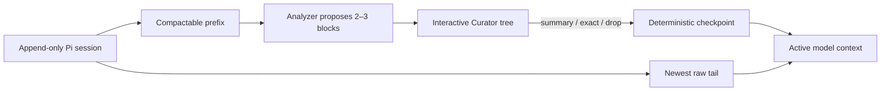

# pi-context-curator

**English** · [简体中文](./README.zh-CN.md)

Interactive, user-controlled context curation for [Pi](https://github.com/earendil-works/pi).

Instead of letting context compaction be a completely automatic, opaque rewrite, this extension asks a fast secondary model to divide the compactable history into only 2–3 semantic blocks. You then decide what to summarize, preserve verbatim, split again, or remove from active context.

The original append-only session remains recoverable. The extension changes the active model context, not the historical JSONL file size.

## Why this exists

Long coding sessions usually fail in one of two ways:

- keeping everything makes every later turn expensive and noisy;
- fully automatic compaction makes important constraints disappear without giving the user a decision point.

Context Curator keeps the lightweight workflow while preserving control:



The analyzer proposes structure; it never applies compaction by itself. Final application remains a user action.

## Features

- Interactive 2–3-way context partitioning.
- A monolithic compactable turn is losslessly pre-split, so the first Curator window still starts with 2–3 choices.
- Natural-language curation instructions can re-group blocks and preselect what to keep, preserve verbatim, or drop.
- Deep hierarchies use short local labels, width-aware metadata, and a wrapped selected-title area instead of repeated parent paths.
- Recursive splitting without summarizing a summary.
- Three retention modes: `summary`, `exact`, and `drop`.
- A newest raw tail that is always kept verbatim.
- Deterministic checkpoint compilation after user selection.
- Manual or automatic Curator triggering.
- New-input priority: queued RPC, intercom, or other incoming input closes a stale automatic Curator.
- Emergency `B` action for explicitly choosing Pi native compaction.
- Session-scoped settings stored outside model-visible context.
- Chinese and English UI/checkpoint/analyzer-output selection.
- Analyzer model and thinking level selected from Pi's existing ModelRegistry.
- Bounded concurrent first-pass analysis for very large histories.
- Coverage, snapshot, dependency, and stale-session guards.
- Recoverable archived block summaries and pre-curation undo.

## Requirements

- Pi with extension support. Development and tests currently target Pi `0.84.2`.
- At least one authenticated Pi model available for use as the analyzer.
- Pi TUI for the interactive Curator and settings overlays.

Non-interactive modes keep Pi's native compaction behavior; they do not open the Curator window.

## Installation

Install directly from GitHub:

```bash
pi install git:github.com/kyrosle/pi-context-curator
```

Raw HTTPS is also supported:

```bash
pi install https://github.com/kyrosle/pi-context-curator
```

Start a new Pi process after installation. When developing from a local checkout, load it directly:

```bash
pi -e /absolute/path/to/pi-context-curator/index.ts
```

Avoid loading both a local checkout and the installed Git package at the same time, because both register `/curate`.

## Quick start

1. Authenticate the model you want to use through Pi.
2. Run `/curate settings` and choose the analyzer, thinking level, language, and trigger mode.
3. Run `/curate` manually, or enable `triggerMode: "auto"`.
4. Review the proposed blocks.
5. Press `A` to apply only when the checkpoint looks right.

With no explicit focus argument, `/curate` uses the newest user request as the next-task focus:

```text
/curate
/curate finish the migration and verify the production build
```

## Commands

| Command | Purpose |
| --- | --- |
| `/curate [focus]` | Analyze the compactable prefix and open the interactive tree. |
| `/curate settings` | Open session-scoped Curator settings. |
| `/curate status` | Show effective configuration and current context usage. |
| `/curate undo` | Move the branch pointer to before the latest Curator checkpoint. No history is deleted. |
| `/curate restore` | Restore the summary of one archived block into active context. |

## Curator keys

| Key | Action |
| --- | --- |
| `Up` / `Down` | Move through blocks. |
| `Space` | Cycle `summary → exact → drop`. |
| `E` | Mark the focused leaf as `exact`. |
| `Enter` / `Right` | Split a leaf into 2–3 children, or expand an existing branch. |
| `Left` | Collapse a branch. |
| `F` | Enter or replace a natural-language curation instruction and regenerate the plan. |
| `I` | Inspect summary, rationale, dependencies, evidence, and source IDs. |
| `P` | Preview the deterministic checkpoint. |
| `S` | Open session settings. Saved values apply to the next `/curate`. |
| `H` | Toggle `boundary` and `handoff` application modes. |
| `A` | Apply the checkpoint. Risky selections require a second `A`. |
| `B` | At the emergency threshold only, close Curator and run Pi native compaction. |
| `Esc` / `Q` | Cancel a manual Curator, or skip an automatic Curator and return to chat. |

While a split is running, `Esc` / `Q` cancels only that split and returns to the tree.

## Natural-language curation instructions

Press `F` in the Curator and describe the result you want, for example:

```text
Keep only the implementation and validation for C. Drop the old A and B approaches. Preserve paths, errors, and commands verbatim.
```

The analyzer re-partitions the same source snapshot and initializes each leaf from its recommended `summary`, `exact`, or `drop` mode. An instruction such as “keep only C” therefore keeps A and B visible as unchecked `drop` candidates instead of silently omitting their source IDs. You can inspect and override every recommendation before Apply; high-risk drops still require confirmation.

Important boundaries:

- instructions affect only the compactable prefix; the newest raw tail remains verbatim;
- `drop` removes content from active model context, not from Pi's append-only session history;
- all source units must still pass the disjoint 100% coverage check;
- the instruction is limited to 2,000 characters, and submitting an empty value clears it;
- applying the regenerated checkpoint remains manual.

The accepted instruction is recorded in the checkpoint so the next model can understand why the context was narrowed.

## Automatic mode and chat priority

`triggerMode` controls whether the Curator is opened manually or automatically.

### `manual` — default

- Curator runs only when you invoke `/curate`.
- Thresholds provide status or warning messages.
- Pi native threshold compaction remains untouched as the final fallback.

### `auto`

The built-in defaults use three pressure levels:

| Context usage | Behavior |
| --- | --- |
| `65%` (`notifyPercent`) | Status reminder only. |
| `80%` (`strongNotifyPercent`) | Analyze and open Curator once in the strong band. |
| `92%` (`emergencyPercent`) | Allow one additional emergency-band Curator and expose `B` for Pi native compaction. |
| Pi's own limit | Pi native compaction can still run if Curator was skipped or a sudden overflow wins the race. |

The Curator is modal: normal composer input is not entered inside the window. It is not a lock, however:

- `Esc` / `Q` skips the current automatic Curator and returns to chat;
- the same pressure band will not reopen it repeatedly;
- reaching the emergency band may offer one final Curator;
- incoming queued input takes priority, aborts the automatic analysis/window, and continues normally;
- after compaction, a session change, or usage dropping below the strong threshold, the automatic gate resets.

Applying is always manual, even in automatic mode.

## Retention modes

### `summary`

Keeps the analyzer-written summary plus short evidence strings that were verified against the source text.

### `exact`

Keeps complete original source units inside a `<verbatim-context>` section. Use this for exact user constraints, paths, commands, hashes, errors, or evidence where rewriting is risky.

### `drop`

Removes the block from active model context. The block summary and source pointers remain in checkpoint metadata so `/curate restore` can recover the summary later.

With `archiveIndex: false`—the default—dropped titles and summaries do not leak back into the model-visible checkpoint.

## Apply modes

### `boundary` — default

Appends a normal Pi compaction boundary in the current session. The deterministic checkpoint replaces the historical prefix while the raw tail remains untouched.

### `handoff`

Creates a clean child session containing the checkpoint. This is useful when moving to a clearly different phase of work.

Neither mode deletes or rewrites the original append-only history.

## Language selection

Set `language` to `zh` or `en` in `/curate settings` or configuration.

The selected language controls:

- settings and Curator overlays;
- loading, progress, status, warning, and error text;
- newly compiled checkpoint headings and metadata;
- the requested language for analyzer-generated titles, summaries, and rationales.

The settings overlay redraws immediately after changing the language. Original raw-tail content and verbatim evidence are never translated. Existing checkpoints are not rewritten retroactively.

## Analyzer model and provider behavior

The analyzer is called through Pi's ModelRegistry. The extension does not implement a separate provider client or credential store.

- `analyzerModel` uses `provider/model-id` syntax.
- The settings popup lists Pi models that are currently available and authenticated.
- Thinking choices come from the selected model's Pi metadata and are clamped when switching models.
- The default selector is `deepseek/deepseek-v4-flash`; change it if that model is not present in your Pi installation.
- With `confirmCrossProvider: true`, Pi asks once per analyzer model in each process before sending the compactable prefix to a provider different from the active chat provider.

The compactable history is sensitive data. Select an analyzer provider whose privacy and retention terms are acceptable for the current session.

## Configuration

Global configuration:

```text
~/.pi/agent/context-curator.json
```

Trusted project override:

```text
<project>/.pi/context-curator.json
```

Effective precedence:

```text
current-session popup override
  → trusted project JSON
  → global JSON
  → built-in defaults
```

Session overrides are persisted as Pi custom entries. They follow session branch history and are not converted into LLM messages.

Example using built-in defaults:

```json
{
  "enabled": true,
  "language": "zh",
  "analyzerModel": "deepseek/deepseek-v4-flash",
  "thinkingLevel": "low",
  "triggerMode": "manual",
  "confirmCrossProvider": true,
  "maxConcurrentAnalyzerCalls": 3,
  "rawTailTokens": 16000,
  "targetCheckpointTokens": 24000,
  "maxAnalyzerInputTokens": 600000,
  "maxBlocksPerSplit": 3,
  "archiveIndex": false,
  "notifyPercent": 65,
  "strongNotifyPercent": 80,
  "emergencyPercent": 92,
  "defaultApplyMode": "boundary"
}
```

| Field | Meaning |
| --- | --- |
| `enabled` | Enables command and threshold behavior. |
| `language` | `zh` or `en` display and generated-summary language. |
| `analyzerModel` | Pi ModelRegistry selector in `provider/model-id` form. |
| `thinkingLevel` | Requested Pi thinking level, clamped to model support. |
| `triggerMode` | `manual` or `auto`. |
| `confirmCrossProvider` | Ask once before first cross-provider analyzer transfer in a Pi process. |
| `maxConcurrentAnalyzerCalls` | Concurrent local groups during hierarchical analysis, from 1 to 4. |
| `rawTailTokens` | Target size of newest history retained verbatim. |
| `targetCheckpointTokens` | Checkpoint size above which Apply requires confirmation. |
| `maxAnalyzerInputTokens` | Configured direct-analysis limit before hierarchical grouping. |
| `maxBlocksPerSplit` | Maximum choices per decision, 2 or 3. |
| `archiveIndex` | Include only archived block titles/IDs/source counts in visible checkpoint text. |
| `notifyPercent` | Status reminder threshold. |
| `strongNotifyPercent` | Automatic Curator strong-band threshold. |
| `emergencyPercent` | Emergency-band threshold and minimum for the `B` action. |
| `defaultApplyMode` | `boundary` or `handoff`. |

Legacy `autoOpenMode` values remain readable: `popup` maps to `auto`; `suggest` and `off` map to `manual`.

## Large-context analysis

If the source prefix fits both `maxAnalyzerInputTokens` and 80% of the selected model's Pi-reported context window, it is analyzed in one global call.

Larger prefixes use a bounded hierarchy:

1. source units are divided into independent groups;
2. groups are analyzed concurrently up to `maxConcurrentAnalyzerCalls`;
3. one global merge restores a coherent final 2–3-block decision;
4. exact evidence from local passes is carried into the merged blocks.

Only independent first-pass groups run concurrently. Recursive user-requested splits are separate analyzer calls.

## Reliability and recovery

- Every source unit must appear exactly once in the analyzer partition.
- Invalid analyzer JSON is retried once, then rejected.
- Evidence strings are retained only when they occur in the original source.
- Recursive splits read original source units, never a summary of a summary.
- A single oversized source unit is losslessly divided into contiguous fragments before semantic splitting.
- Snapshot identity is retained, and the session leaf is checked before Apply.
- New input invalidates an active automatic Curator before its stale result can be shown or applied.
- Dropping high-risk content, dropping all blocks, breaking a declared dependency, or exceeding the checkpoint target requires a second `A`.
- Accepted blocks are stored as a structured ledger so later curation can re-expand them independently.
- `/curate undo` changes the branch pointer without deleting history.
- `/curate restore` can reintroduce an archived summary.

## Practical limits

- Model-written summaries remain model output. Review them before applying.
- An analyzer may occasionally ignore the requested output language; strict language rejection is intentionally avoided because technical paths and quoted evidence can legitimately contain another script.
- Repeated recursive splitting increases latency and analyzer token usage.
- The extension reduces active context, not the on-disk append-only session size.
- Sudden context overflow may trigger Pi native compaction before an automatic Curator can open.
- The TUI window is required for interactive decisions.

## Development

```bash
bun test ./tests
bun run check
```

`bun run check` performs strict TypeScript checking and a Bun bundle smoke build. The test suite covers configuration, bilingual UI, source ledgers, analyzer dispatch, hierarchical concurrency, pressure-band gating, new-input preemption, native fallback, overlay input, checkpoint compilation, and extension registration.
