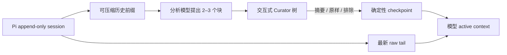

# pi-context-curator

[English](./README.md) · **简体中文**

面向 [Pi](https://github.com/earendil-works/pi) 的交互式、用户可控上下文策展插件。

它不会让上下文压缩变成一次完全自动且不透明的重写，而是让一个快速的额外模型把可压缩历史拆成每次仅 2–3 个语义块，再由你决定哪些内容保留摘要、原样保留、继续细拆或从 active context 排除。

原始 append-only session 始终可以恢复。插件缩小的是模型当前使用的 active context，不是磁盘上的 JSONL 历史文件。

## 为什么需要它

长时间编码 session 通常会落入两个极端：

- 什么都保留，导致后续每轮越来越贵、越来越嘈杂；
- 完全自动压缩，关键约束可能在没有用户决策点的情况下消失。

Context Curator 在保持轻量化的同时，把控制权留给用户：



分析模型只负责提出结构，不会自行应用压缩。最终 Apply 始终由用户执行。

## 主要能力

- 每次只提供 2–3 个上下文选项。
- 可以递归细拆，并且不会对摘要再次摘要。
- 三种保留模式：`summary`、`exact`、`drop`。
- 最新 raw tail 始终原样保留。
- 用户选择完成后，确定性编译 checkpoint，不再让模型二次改写。
- 支持手动或自动触发 Curator。
- 新输入优先：排队的 RPC、intercom 或其他输入会关闭已经过时的自动 Curator。
- 紧急区提供 `B`，可明确选择 Pi 原生 compaction。
- Session 级设置存储在模型不可见的 custom entry 中。
- 支持中英文界面、checkpoint 和分析模型输出语言。
- 直接从 Pi ModelRegistry 选择分析模型和 thinking level。
- 大上下文支持受控并发的分层分析。
- 包含来源覆盖、快照、依赖和 session 过期校验。
- 支持恢复归档摘要和回到策展前节点。

## 环境要求

- 支持扩展的 Pi。目前开发与测试基于 Pi `0.84.2`。
- 至少有一个已认证、可用作分析器的 Pi 模型。
- 交互式 Curator 和设置窗口需要 Pi TUI。

非交互模式不会打开 Curator 窗口，并继续保留 Pi 原生压缩行为。

## 安装

直接从 GitHub 安装：

```bash
pi install git:github.com/kyrosle/pi-context-curator
```

也可以使用 HTTPS：

```bash
pi install https://github.com/kyrosle/pi-context-curator
```

安装后重新启动 Pi。开发本地 checkout 时可以直接加载：

```bash
pi -e /absolute/path/to/pi-context-curator/index.ts
```

不要同时加载本地 checkout 和已经安装的 Git 包，否则两边都会注册 `/curate`。

## 快速开始

1. 在 Pi 中认证你准备作为分析器的模型。
2. 执行 `/curate settings`，选择分析模型、thinking level、语言和触发方式。
3. 手动执行 `/curate`，或者把 `triggerMode` 设为 `auto`。
4. 检查模型提出的上下文块。
5. 只有在 checkpoint 符合预期时才按 `A` 应用。

不传入焦点时，`/curate` 会自动采用最近一条用户请求作为下一阶段焦点：

```text
/curate
/curate 完成迁移并验证生产构建
```

## 命令

| 命令 | 作用 |
| --- | --- |
| `/curate [focus]` | 分析可压缩前缀并打开交互树。 |
| `/curate settings` | 打开当前 session 的覆盖设置。 |
| `/curate status` | 显示有效配置和当前上下文用量。 |
| `/curate undo` | 把分支指针移动到最近一次 Curator checkpoint 之前，不删除历史。 |
| `/curate restore` | 把某个归档块的摘要恢复到 active context。 |

## Curator 按键

| 按键 | 操作 |
| --- | --- |
| `Up` / `Down` | 在上下文块之间移动。 |
| `Space` | 循环 `summary → exact → drop`。 |
| `E` | 把当前叶子标记为 `exact`。 |
| `Enter` / `Right` | 把叶子细拆成 2–3 个子块，或展开已有分支。 |
| `Left` | 折叠分支。 |
| `I` | 查看摘要、保留理由、依赖、证据和来源 ID。 |
| `P` | 预览确定性 checkpoint。 |
| `S` | 打开 session 设置；保存内容从下一次 `/curate` 生效。 |
| `H` | 切换 `boundary` 与 `handoff` 应用方式。 |
| `A` | 应用 checkpoint；高风险选择需要再次按 `A`。 |
| `B` | 仅在紧急阈值出现，关闭 Curator 并运行 Pi 原生 compaction。 |
| `Esc` / `Q` | 取消手动 Curator，或者跳过自动 Curator 并返回聊天。 |

正在执行某次细拆时，`Esc` / `Q` 只会取消该次细拆并返回上下文树。

## 自动模式与聊天优先级

`triggerMode` 决定 Curator 由用户手动调用还是根据压力自动打开。

### `manual`——默认

- 只有用户执行 `/curate` 才会运行 Curator。
- 阈值只显示状态或提醒。
- Pi 原生阈值压缩保持不变，继续作为最终兜底。

### `auto`

内置默认值包含三个压力阶段：

| 上下文用量 | 行为 |
| --- | --- |
| `65%`（`notifyPercent`） | 只显示状态提醒。 |
| `80%`（`strongNotifyPercent`） | 自动分析，并在强提醒区间最多打开一次 Curator。 |
| `92%`（`emergencyPercent`） | 紧急区最多再打开一次，并显示 `B` 原生兜底操作。 |
| Pi 自身限制 | 如果用户跳过 Curator 或突然溢出抢先发生，Pi 原生 compaction 仍然可以运行。 |

Curator 是模态窗口：不能直接在窗口内部使用普通 composer 输入新聊天内容。但它不会锁住用户：

- `Esc` / `Q` 会跳过这次自动策展并返回聊天；
- 同一个压力区间不会反复弹窗；
- 进入紧急区后最多再提供一次 Curator；
- 新到达的排队输入拥有更高优先级，会终止自动分析或关闭窗口，然后正常继续；
- 完成 compaction、切换 session，或者用量下降到强提醒阈值以下后，自动门控会重置。

即使使用 `auto`，Apply 也始终是手动操作。

## 保留模式

### `summary`

保留分析模型生成的摘要，以及经过原始来源校验的短证据字符串。

### `exact`

在 `<verbatim-context>` 中保留完整原始来源单元。适合不能安全改写的用户约束、路径、命令、哈希、错误和验证证据。

### `drop`

从模型 active context 排除该块。块摘要和来源指针仍保存在 checkpoint metadata 中，因此之后可以通过 `/curate restore` 恢复摘要。

默认 `archiveIndex: false`，被排除块的标题和摘要不会重新泄漏到模型可见 checkpoint 中。

## 应用方式

### `boundary`——默认

在当前 session 中追加普通 Pi compaction boundary。确定性 checkpoint 替代历史前缀，raw tail 保持原样。

### `handoff`

创建包含 checkpoint 的干净子 session。适合明确进入一个新工作阶段时使用。

两种方式都不会删除或改写原始 append-only 历史。

## 语言切换

可以在 `/curate settings` 或 JSON 配置中把 `language` 设为 `zh` 或 `en`。

语言设置会控制：

- 设置窗口和 Curator 窗口；
- loading、进度、状态、警告和错误；
- 新编译 checkpoint 的标题与 metadata；
- 分析模型生成标题、摘要和理由时要求使用的语言。

在设置窗口中切换后会立即重绘。原始 raw tail 和原样证据永远不会被翻译，已有 checkpoint 也不会被追溯改写。

## 分析模型与 Provider

分析器直接通过 Pi ModelRegistry 调用。插件没有自己实现另一套 Provider client 或凭据存储。

- `analyzerModel` 使用 `provider/model-id` 格式。
- 设置窗口会列出 Pi 当前已经认证并可用的模型。
- Thinking 选项来自所选模型的 Pi metadata，切换模型时会自动 clamp。
- 默认选择器是 `deepseek/deepseek-v4-flash`；如果你的 Pi 没有这个模型，请在设置中更换。
- `confirmCrossProvider: true` 时，如果分析器 Provider 与当前聊天 Provider 不同，每个 Pi 进程、每个分析模型第一次发送前会询问一次。

可压缩历史本身可能包含敏感信息，请只选择你认可其隐私和数据保留条款的分析 Provider。

## 配置

全局配置：

```text
~/.pi/agent/context-curator.json
```

受信任项目的覆盖配置：

```text
<project>/.pi/context-curator.json
```

有效优先级：

```text
当前 session 弹窗 override
  → 受信任项目 JSON
  → 全局 JSON
  → 内置默认值
```

Session override 会保存为 Pi custom entry，跟随 session 分支历史，并且不会被转换成 LLM message。

内置默认配置示例：

```json
{
  "enabled": true,
  "language": "zh",
  "analyzerModel": "deepseek/deepseek-v4-flash",
  "thinkingLevel": "low",
  "triggerMode": "manual",
  "confirmCrossProvider": true,
  "maxConcurrentAnalyzerCalls": 3,
  "rawTailTokens": 16000,
  "targetCheckpointTokens": 24000,
  "maxAnalyzerInputTokens": 600000,
  "maxBlocksPerSplit": 3,
  "archiveIndex": false,
  "notifyPercent": 65,
  "strongNotifyPercent": 80,
  "emergencyPercent": 92,
  "defaultApplyMode": "boundary"
}
```

| 字段 | 含义 |
| --- | --- |
| `enabled` | 启用命令和阈值行为。 |
| `language` | `zh` 或 `en`，控制显示和生成摘要语言。 |
| `analyzerModel` | Pi ModelRegistry 中的 `provider/model-id` 选择器。 |
| `thinkingLevel` | 请求的 Pi thinking level，会按模型能力 clamp。 |
| `triggerMode` | `manual` 或 `auto`。 |
| `confirmCrossProvider` | 每个 Pi 进程首次向不同 Provider 的分析器发送历史前确认。 |
| `maxConcurrentAnalyzerCalls` | 分层分析局部分组的并发数，范围 1–4。 |
| `rawTailTokens` | 最新、始终原样保留历史的目标大小。 |
| `targetCheckpointTokens` | checkpoint 超过该目标后，Apply 需要确认。 |
| `maxAnalyzerInputTokens` | 超过该直接分析阈值后改用分层分组。 |
| `maxBlocksPerSplit` | 每次决策最多 2 或 3 个块。 |
| `archiveIndex` | 是否在可见 checkpoint 中包含归档块标题、ID 和来源数量。 |
| `notifyPercent` | 状态提醒阈值。 |
| `strongNotifyPercent` | 自动 Curator 强提醒区阈值。 |
| `emergencyPercent` | 紧急区阈值，也是显示 `B` 的最低阈值。 |
| `defaultApplyMode` | `boundary` 或 `handoff`。 |

旧版 `autoOpenMode` 仍然可以读取：`popup` 映射为 `auto`，`suggest` 和 `off` 映射为 `manual`。

## 大上下文分析

如果历史前缀同时没有超过 `maxAnalyzerInputTokens`，并且低于所选模型在 Pi 中报告 context window 的 80%，插件会使用一次全局分析。

更大的前缀使用受控分层流程：

1. 把来源单元分成相互独立的组；
2. 以不超过 `maxConcurrentAnalyzerCalls` 的并发分析各组；
3. 使用一次全局 merge 恢复一致的最终 2–3 块结构；
4. 把局部分析获得的原样证据带入最终块。

只有相互独立的第一阶段分组会并发。用户主动进行的递归细拆仍是独立分析调用。

## 可靠性与恢复

- 每个来源单元必须在分析结果中恰好出现一次。
- 无效的分析模型 JSON 会重试一次，之后拒绝使用。
- 证据字符串只有确实存在于原始来源中才会被保留。
- 递归细拆读取原始来源单元，不会摘要再摘要。
- 单个超大来源单元会先无损切成连续片段，再进行语义拆分。
- 保留快照身份，并在 Apply 前重新检查 session leaf。
- 新输入会使活动中的自动 Curator 失效，旧结果不会继续显示或应用。
- 排除高风险块、排除所有块、破坏依赖或者超过 checkpoint 目标，需要再次按 `A`。
- 已接受的块保存为结构化 ledger，下一次策展可以再次独立展开。
- `/curate undo` 只移动分支指针，不删除历史。
- `/curate restore` 可以重新引入归档摘要。

## 实际限制

- 模型摘要仍然是模型输出，应用前必须人工检查。
- 分析模型偶尔可能不遵循输出语言；插件不会做严格语言拒绝，因为路径、技术词和原样证据可能合理地包含另一种文字。
- 反复递归细拆会增加延迟和分析 token 消耗。
- 插件减少的是 active context，不会缩小磁盘上的 append-only session。
- 突然的上下文溢出可能让 Pi 原生 compaction 先于自动 Curator 触发。
- 交互式决策必须使用 TUI。

## 开发

```bash
bun test ./tests
bun run check
```

`bun run check` 会执行严格 TypeScript 检查和 Bun bundle smoke build。测试覆盖配置、双语 UI、来源 ledger、分析器调度、分层并发、压力区门控、新输入抢占、原生兜底、overlay 输入、checkpoint 编译和扩展注册。
